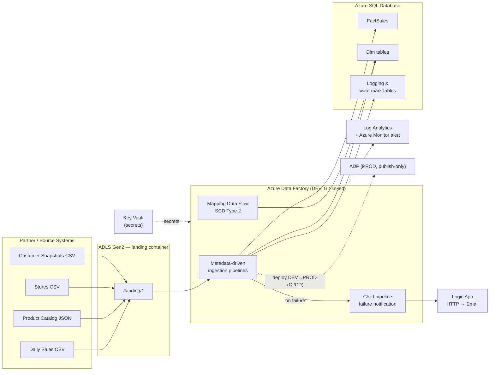
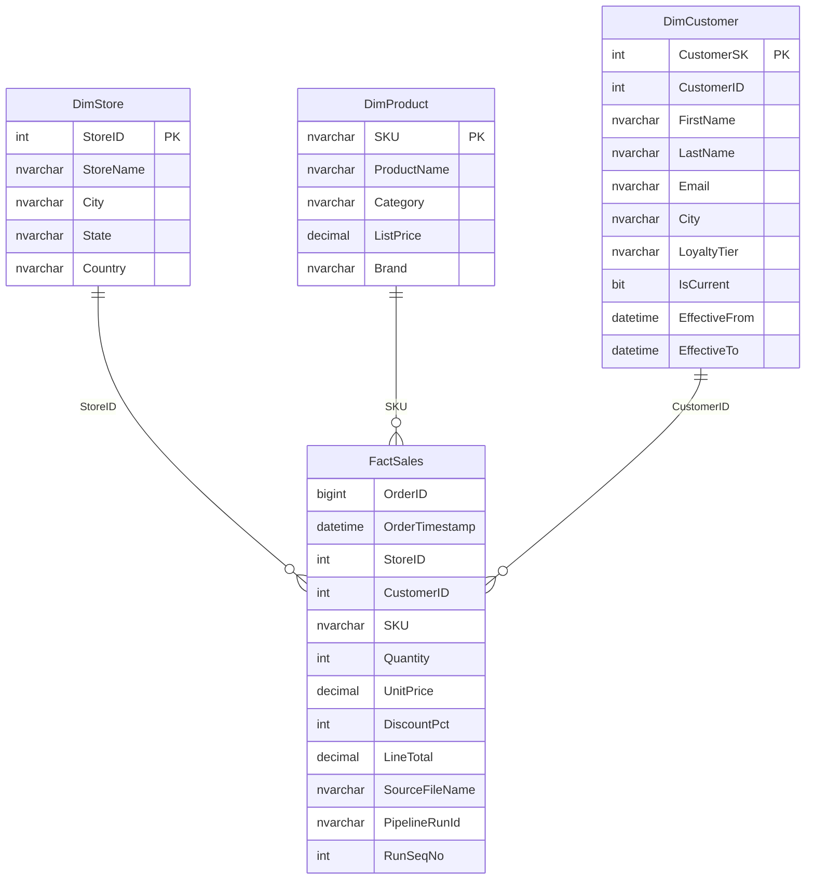
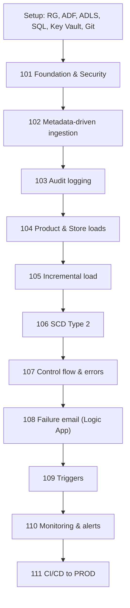

# NovaMart — Partner Sales Ingestion & Orchestration Platform

**Project:** NMDP · Data Platform Engineering
**Component:** Azure Data Factory
**Type:** New build — end-to-end ingestion & orchestration

---

## 1. Overview

NovaMart is a mid-size omnichannel retailer operating eight physical stores plus an online channel across the United States. Sales, product, customer and store data arrive as partner-supplied files and system exports, and are currently reconciled by hand in spreadsheets. Month-end reporting is late and the numbers are not trusted.

This project delivers the first production-grade data pipeline in Azure Data Factory: it ingests every feed automatically on a schedule, lands the data in a governed Azure SQL database, tracks history where it matters, and raises an alert the moment anything fails.

> **Background driver:** a feed once failed silently for a full week and was noticed only after it reached finance. Observability and failure notification are first-class requirements here, not afterthoughts.

---

## 2. Source Feeds

A third-party channel partner drops files into a storage landing zone. A representative one-week sample is provided under `source_data/` (see [Appendix A](#appendix-a--provided-files)).

| Feed | Format & cadence | Notes |
|------|------------------|-------|
| **Daily Sales** | One CSV per day — `sales_YYYYMMDD.csv` | Filename encodes the business date. ~40–70 orders/day. One deliberately malformed file is included to exercise error handling. |
| **Product Catalog** | Nested JSON — `product_catalog.json` | Export from the merchandising system; a `products` array with a nested `attributes` object. |
| **Stores** | Reference CSV — `stores.csv` | Small, slowly-changing lookup of store locations. |
| **Customers** | Two dated CSV snapshots | `customers_20260720` (initial) and `customers_20260727` (tier changes, city moves, new customers) — the Slowly Changing Dimension source. |

---

## 3. Target Architecture



**Services provisioned and wired together:**

| Service | Purpose |
|---------|---------|
| Azure Data Factory (DEV, Git-linked) | Authoring + orchestration |
| Azure Data Factory (PROD, publish-only) | CI/CD deployment target |
| ADLS Gen2 storage account | Landing zone for partner files |
| Azure SQL Database | Destination + logging store (scripts in `sql/`) |
| Azure Key Vault | Connection strings / secrets — no plaintext in linked services |
| Azure Logic App (Consumption) | HTTP-triggered email on failure |
| Log Analytics + Azure Monitor | Diagnostics, KQL, alert rules |
| Azure DevOps (Repos + Pipelines) | Source control & CI/CD |

---

## 4. Data Model



Supporting control tables (not shown above): `PipelineExecution`, `FileMetadata`, `LoadingError`, `LoadWatermark`, `EmailRecipient` — created by the scripts in `sql/`.

---

## 5. Definition of Done

- **Automated** — every feed lands in Azure SQL on a schedule, with no manual steps.
- **Observable** — every run is logged; any failure emails the on-call list within minutes.
- **Reusable** — adding a ninth store or a new file type must not require rebuilding pipelines.
- **Deployable** — all factory resources are in Git and deploy to a separate PROD factory via CI/CD.

---

## 6. Environment Setup

Complete before building pipelines:

1. Create a resource group (e.g. `rg-novamart-dev`) containing an ADF instance, an ADLS Gen2 storage account, an Azure SQL Database, and a Key Vault.
2. Link the DEV data factory to an Azure DevOps Git repo — collaboration branch `main`, publish branch `adf_publish`.
3. Create a `landing` container and upload `source_data/`, preserving the folder structure.
4. Run the SQL scripts **in order**: `01_create_tables.sql`, `02_create_logging.sql`, `03_create_procedures.sql`. Set the recipient email in `02` to a real address to receive test alerts.
5. Store the storage account connection string as a Key Vault secret and grant the ADF managed identity a **Get** access policy.

---

## 7. Requirements — Epics & User Stories

Deliver roughly in order; later epics build on earlier ones. Acceptance criteria define completion.

### NMDP-101 · Foundation & Secure Connections
> **Story:** Connect ADF to storage and SQL through Key Vault so no credentials are stored in plaintext and connections are reused everywhere.

- [ ] Key Vault linked service created; Blob/ADLS linked service reads its connection string from a **secret** (no hard-coded key).
- [ ] Azure SQL linked service created, connection secret also vaulted.
- [ ] **One** parameterized delimited-text dataset (params: container / folder / file) instead of a dataset per feed, and **one** parameterized Azure SQL table dataset (param: table name).
- [ ] Factory committed to Git; pipeline JSON visible in a feature branch.

### NMDP-102 · Metadata-Driven File Ingestion
> **Story:** Every CSV that lands in `daily_sales` is picked up automatically — no one has to "run the load".

- [ ] `Get Metadata` lists the `childItems` of the `daily_sales` folder.
- [ ] `Filter` keeps only files ending in `.csv`.
- [ ] `ForEach` iterates the filtered list; per file a `Copy` loads into `dbo.FactSales` using the parameterized datasets (`filename = @item().name`).
- [ ] Copy adds lineage columns: `SourceFileName` and `PipelineRunId` (`@pipeline().RunId`).
- [ ] Re-running does not duplicate rows for an already-loaded file (pre-copy truncate on staging, or a documented idempotency approach).

### NMDP-103 · Audit Logging with Expressions & Variables
> **Story:** Every run is recorded with row counts and status, so we can prove what loaded and when.

- [ ] `Lookup` calls `dbo.LogPipelineStart` and returns a `RunSeqNo`.
- [ ] `RunSeqNo` stored in a pipeline variable via `Set Variable`, written into `FactSales` per row.
- [ ] `Stored Procedure` calls `dbo.LogPipelineEnd` with final status and Copy output (`rowsRead` / `rowsCopied` / `filesRead`) via `@activity(...).output`.
- [ ] `dbo.PipelineExecution` shows one complete row per run with `StartTime`, `EndTime`, `Status = Success`.

### NMDP-104 · Product & Store Loads (JSON + Reference)
> **Story:** Product catalog and store list loaded into dimensions so sales can be reported by product and location.

- [ ] `Copy` flattens `product_catalog.json` (Collection Reference = `products`; map nested `attributes.brand`) into `dbo.DimProduct`.
- [ ] `stores.csv` loaded into `dbo.DimStore` with an explicit, correct column mapping.
- [ ] *(Optional)* also land the catalog as a Parquet file in an `output` container.

### NMDP-105 · Incremental Sales Load (Watermark)
> **Story:** Daily sales load incrementally, so a re-run only processes new files and stays fast as volume grows.

- [ ] `Lookup` reads the current watermark from `dbo.LoadWatermark` for `FactSales`.
- [ ] Only files/records newer than the watermark (by filename date or `OrderTimestamp`) are loaded.
- [ ] After success, `dbo.UpdateWatermark` advances the watermark.
- [ ] Running twice consecutively loads new data first time, nothing the second.

### NMDP-106 · Customer Dimension — Slowly Changing Dimension
> **Story:** Keep customer history, so a past order still reflects the tier the customer held at the time.

- [ ] A Mapping Data Flow loads `customers_20260720.csv` into `dbo.DimCustomer` as the initial load (all rows `IsCurrent = 1`).
- [ ] A second run with `customers_20260727.csv` applies **SCD Type 2**: changed records close the old row (`IsCurrent = 0`, `EffectiveTo` set) and insert a new current row; unchanged rows untouched; new customers inserted.
- [ ] At least one `CustomerID` demonstrably has two rows (history + current).

### NMDP-107 · Control Flow & Error Handling
> **Story:** A bad file (like the malformed `sales_20260727.csv`) is handled gracefully and logged, never crashing the batch silently.

- [ ] Copy activities use **failure** dependency branches calling `dbo.InsertLoadingError` (pipeline, run id, activity, error message).
- [ ] An `If Condition` (or `Switch`) branches behaviour on a checked condition (e.g. route/skip files failing validation).
- [ ] Processing the broken file records an error row in `dbo.LoadingError` while the good files still load (fault tolerance / error branch).

### NMDP-108 · Reusable Failure-Notification (Logic App)
> **Story:** An email is sent the moment a load fails — a feed can never break silently again.

- [ ] Consumption Logic App with an HTTP request trigger accepts `{ emailAddress, subject, messageBody }` and sends email.
- [ ] A **child** pipeline looks up `dbo.EmailRecipient`, `ForEach`-iterates recipients, and a `Web` activity POSTs to the Logic App URL per recipient.
- [ ] The **parent** ingestion pipeline calls the child via `Execute Pipeline` on the failure branch.
- [ ] Forcing a failure (e.g. wrong sink table) produces an email.

### NMDP-109 · Automation with Triggers
> **Story:** The platform runs on its own each morning and also reacts immediately when a file lands.

- [ ] A **Schedule** trigger runs the master pipeline daily (test short-interval first, then set the real schedule).
- [ ] An **Event** trigger fires the sales load on blob-created in `daily_sales`; file name passed via `@triggerBody().fileName`.
- [ ] Document where a **Tumbling Window** trigger fits for backfilling historical windows.

### NMDP-110 · Monitoring, Metrics & Alerting
> **Story:** A view of runs and an automatic failure alert, independent of the email pipeline.

- [ ] Pipelines carry **annotations** and Copy activities carry **user properties** for filtering in the Monitor hub.
- [ ] Diagnostic settings send `PipelineRuns` / `ActivityRuns` / `TriggerRuns` to a Log Analytics workspace.
- [ ] A KQL query returns failed runs (e.g. `ADFPipelineRun | where Status == "Failed"`).
- [ ] An Azure Monitor alert on failed pipeline runs > 0 notifies an action group.

### NMDP-111 · Publish to Production (CI/CD)
> **Story:** Changes promote from DEV to PROD safely and repeatably — no click-ops in production.

- [ ] A second, non-Git **PROD** data factory exists.
- [ ] Publishing DEV generates the ARM template on `adf_publish`.
- [ ] An Azure DevOps pipeline deploys the ARM template to PROD (incremental mode), parameterizing environment-specific values (Key Vault URL, connection strings).
- [ ] A change in DEV can be shown flowing to PROD through the pipeline.

---

## 8. Delivery Sequence



---

## 9. Deliverables

- Working DEV data factory (in Git) with all pipelines, data flows, datasets, linked services and triggers.
- Azure SQL Database populated with `FactSales`, the three dimensions, and populated logging tables.
- A short design note (1–2 pages): naming conventions, how the metadata-driven load works, assumptions.
- Evidence pack (screenshots or short recording): a successful scheduled run, audit log rows, a failure email, the Monitor/KQL view.
- PROD factory with at least one pipeline deployed via CI/CD.

---

## 10. Optional Extensions

- Global parameters for environment name, surfaced in log comments to distinguish DEV vs PROD.
- Self-Hosted Integration Runtime scenario: one feed sourced from an "on-prem" SQL Server.
- Power Query / wrangling data flow to clean and aggregate sales before load.
- A Log Analytics Workbook (or Power BI) dashboard of daily run counts and row volumes.
- Parallel vs. sequential `ForEach` — measure and document the runtime difference.

---

## Appendix A · Provided Files

```
NovaMart_DataPlatform_Project/
├── NovaMart_ADF_Project.md                     <- this document
├── source_data/
│   ├── partner_drops/
│   │   ├── daily_sales/    sales_20260720.csv … sales_20260727.csv  (last file malformed)
│   │   ├── products/       product_catalog.json
│   │   └── stores/         stores.csv
│   └── customers/          customers_20260720.csv + customers_20260727.csv
└── sql/
    ├── 01_create_tables.sql
    ├── 02_create_logging.sql
    └── 03_create_procedures.sql
```

**Daily sales file schema (CSV):**

| Column | Description |
|--------|-------------|
| `OrderID` | Unique order/line identifier (BIGINT) |
| `OrderTimestamp` | Date & time of the sale |
| `StoreID` | FK → `DimStore` (101–108) |
| `CustomerID` | FK → `DimCustomer` business key |
| `SKU` | FK → `DimProduct` (e.g. `NM-1001`) |
| `Quantity` | Units sold |
| `UnitPrice` | Price per unit |
| `DiscountPct` | Percent discount applied (0–10) |
| `LineTotal` | Extended amount after discount |

---

## Appendix B · Naming Conventions

| Object | Pattern | Example |
|--------|---------|---------|
| Pipelines | `pl_<area>_<action>` | `pl_sales_ingest_daily` |
| Data flows | `df_<action>` | `df_scd_customer` |
| Datasets | `ds_<type>_<generic>` | `ds_csv_generic`, `ds_sql_table` |
| Linked services | `ls_<service>` | `ls_adls_kv`, `ls_sql_kv`, `ls_keyvault` |
| Triggers | `tr_<type>_<pipeline>` | `tr_schedule_daily`, `tr_event_sales` |
